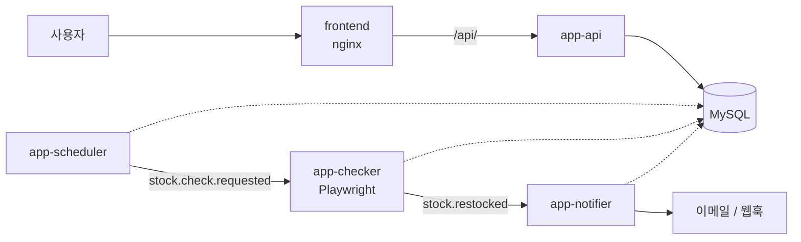

# jaeipgo-alimi

네이버 스마트 스토어 품절 상품 재입고 알림

- **설계 문서** — [docs/DESIGN.md](docs/DESIGN.md)
- **로컬 k8s 배포** — [k8s/README.md](k8s/README.md)

## 구조

배포 단위가 곧 모듈이다.

```
backend/
├── contract/          의존성 0. Kafka 이벤트 DTO + 토픽 이름
├── core/              엔티티 / 리포지토리 / 도메인 / Flyway / 공통 설정
├── app-api/           REST API
├── app-scheduler/     배치 스케줄러 (반드시 단일 인스턴스)
├── app-checker/       Playwright 재고 판정 워커 (KEDA 오토스케일)
└── app-notifier/      팬아웃 + 알림 발송 워커 (KEDA 오토스케일)
frontend/              Vite → 정적 빌드 → nginx
k8s/                   kind + KEDA + 마이그레이션 Job
```



## 기술 스택

| 구분 | 선택 |
|------|------|
| 언어 / 런타임 | Kotlin 2.1, JDK 21 |
| 프레임워크 | Spring Boot 3.5 (web, data-jpa, validation, actuator) |
| 빌드 | Gradle (Kotlin DSL) 멀티모듈 + Wrapper |
| DB | MySQL 8.4 |
| 마이그레이션 | Flyway 11 (`backend/core/src/main/resources/db/migration`) |
| 메시징 | Apache Kafka (Spring Kafka, KRaft 모드) |
| 브라우저 자동화 | Playwright 1.62 (`app-checker` 전용) |
| 프론트엔드 | Vite 7 (정적 빌드, 런타임 Node 없음) |
| 로컬 인프라 | Docker Compose / kind + KEDA |
| 테스트 | JUnit5, Testcontainers (mysql, kafka) |

## 실행 방법

### 1) 인프라만 도커, 앱은 로컬에서 (개발 시 기본)

```bash
cp .env.example .env
docker compose up -d                        # mysql + kafka

./gradlew :backend:app-api:bootRun          # 필요한 앱만 골라 실행
./gradlew :backend:app-notifier:bootRun
```

로컬 앱은 `localhost:3306`(MySQL), `localhost:29092`(Kafka)에 접속한다.
`local` 프로파일에서는 앱이 Flyway 마이그레이션도 직접 돌린다.

### 2) 전부 도커로

```bash
docker compose --profile app --profile tools up --build
```

- 프론트: http://localhost:3000
- API: http://localhost:8080
- Kafka UI: http://localhost:8081

마이그레이션은 `migration` 서비스가 먼저 완료된 뒤 앱들이 뜬다.

### 3) 로컬 쿠버네티스 (kind + KEDA)

오토스케일까지 보려면 이쪽. → [k8s/README.md](k8s/README.md)

```bash
kind create cluster --config k8s/kind-cluster.yaml
# ... 이미지 빌드/적재 → KEDA 설치 → kubectl apply -k k8s/
open http://localhost:8080
```

## 자주 쓰는 명령

```bash
./gradlew build          # 전 모듈 컴파일 + 테스트
./gradlew test           # 테스트 (Docker 필요 - Testcontainers)
./gradlew bootJar        # 앱 4종의 실행 가능 jar
```

## 회원 인증

현재는 없다. 추가할 때는 `spring-boot-starter-security`(+ 필요 시 `oauth2-resource-server`)를
**`app-api` 에만** 넣고 `SecurityFilterChain` 빈을 정의한다. 워커들은 HTTP 진입점이 없으므로
영향받지 않는다.
