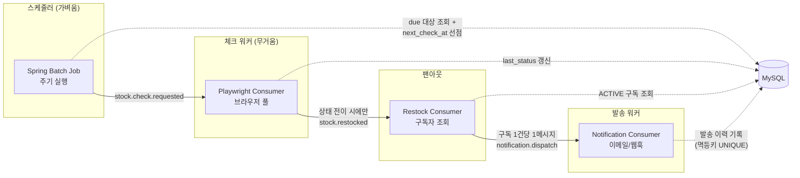
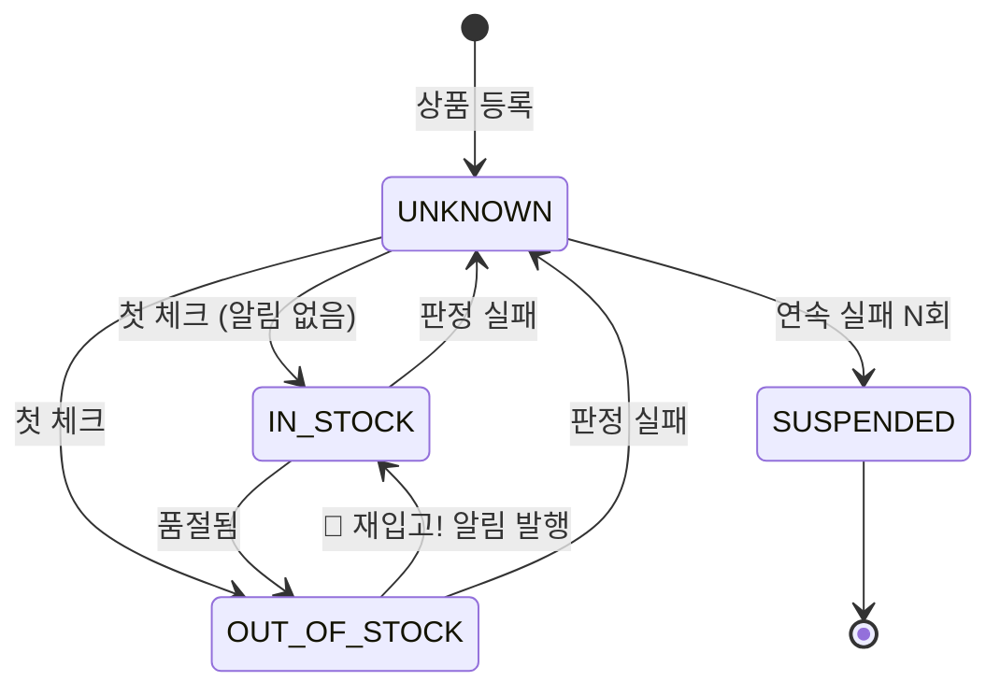

# jaeipgo-alimi 설계 문서

네이버 스마트스토어 품절 상품의 재입고를 감지해 구독자에게 알리는 서비스.

> 이 문서는 **설계 합의문**입니다. 구현이 문서와 달라지면 문서를 고치거나, 문서에 맞게 구현을 고칩니다.
> `[결정]` = 확정, `[제안]` = Claude 권고안(뒤집어도 됨), `[미결정]` = 아직 정해야 할 것.

---

## 1. 핵심 아이디어

네이버 스마트스토어 상품 페이지에는 **"구매하기" 버튼**이 있다.
품절이면 이 버튼이 비활성화되고 문구가 "품절되었습니다"로 바뀐다.

주기적으로 이 버튼의 상태를 확인해서, **품절 → 구매 가능**으로 바뀌는 순간 구독자에게 알린다.

페이지가 JS로 렌더링되므로 단순 HTTP GET + HTML 파싱으로는 버튼 상태를 알 수 없다.
따라서 **Playwright(헤드리스 브라우저)** 로 실제 렌더링 후 버튼을 검사한다.

---

## 2. 전체 흐름



### 단계별 설명

| # | 주체 | 하는 일 |
|---|------|---------|
| 1 | **Spring Batch Job** | 검사할 때가 된 상품(`next_check_at <= now`)을 조회하고, 즉시 `next_check_at`을 미래로 밀어(선점) `stock.check.requested` 발행 |
| 2 | **Playwright Consumer** | 메시지 하나당 브라우저 컨텍스트 하나로 페이지 열고 구매 버튼 상태 판정 → `product.last_status` 갱신 |
| 3 | 〃 | **`OUT_OF_STOCK → IN_STOCK` 전이일 때만** `stock.restocked` 발행 |
| 4 | **Restock Consumer** | 해당 상품의 `ACTIVE` 구독을 모두 조회 → 구독 1건당 `notification.dispatch` 1건 발행 |
| 5 | **Notification Consumer** | 채널별 발송 → `notification_log` 기록, 구독 상태를 `NOTIFIED`로 변경 |

---

## 3. 핵심 설계 결정

### 3.1 `[결정]` 체크는 **상품 단위**, 알림은 **구독 단위**

같은 상품을 100명이 구독해도 Playwright는 **1번만** 돌아야 한다.
그래서 `product`와 `watch`(구독)를 분리하고, 브라우저를 쓰는 무거운 작업은 `product` 기준으로만 수행한다.
팬아웃(1 상품 → N 구독자)은 브라우저를 놓은 뒤 `stock.restocked` 컨슈머에서 일어난다.

### 3.2 `[제안]` 알림 이벤트는 **Kafka** — 단, 스프링 이벤트도 다른 역할로 함께 쓴다

원래 고민이 "알림 이벤트를 스프링 이벤트로 할까, 카프카로 할까"였는데,
**둘은 경쟁 관계가 아니라 서로 다른 계층**이다.

**컴포넌트 간 경계 = Kafka**

| 이유 | 설명 |
|------|------|
| 자원 프로파일이 다름 | Playwright 워커는 브라우저(수백 MB)를 물고 있다. 여기서 SMTP 응답을 기다리면 가장 비싼 자원이 I/O 대기로 놀게 된다 |
| 팬아웃 | 재입고 1건 → 구독자 N명. 알림 발송은 독립적으로 스케일해야 한다 |
| 재시도 / DLQ | 외부 채널(SMTP, 웹훅)은 실패가 잦다. Kafka 재시도 + DLT가 사실상 공짜 |
| 장애 격리 | 메일 서버가 죽어도 재고 감지는 계속 돌아야 한다 |
| 재처리 | 발송 로직 버그를 고친 뒤 오프셋을 되감아 재발송할 수 있다 |

**프로세스 내부 = 스프링 이벤트 (`@TransactionalEventListener`)**

여기서 스프링 이벤트가 진짜로 값을 한다. DB 저장과 Kafka 발행을 같이 하면
**dual-write 문제**가 생긴다 — 커밋은 됐는데 발행이 실패하거나, 발행은 됐는데 롤백되거나.

```kotlin
// 도메인: 상태를 바꾸고 "사실"만 등록한다. Kafka를 모른다.
@Transactional
fun applyCheckResult(productId: Long, status: StockStatus) {
    val product = productRepository.findByIdOrThrow(productId)
    val transitioned = product.updateStatus(status)   // OUT_OF_STOCK -> IN_STOCK 이면 true
    if (transitioned) {
        eventPublisher.publishEvent(ProductRestocked(product.id!!, Instant.now()))
    }
}

// 인프라: 커밋이 확정된 뒤에만 Kafka로 내보낸다.
@TransactionalEventListener(phase = AFTER_COMMIT)
fun on(event: ProductRestocked) {
    kafkaTemplate.send(Topics.STOCK_RESTOCKED, event.productId.toString(), event)
}
```

**정리:** 스프링 이벤트 = 커밋 이후에 발행하기 위한 in-process 훅 + 도메인이 Kafka를 모르게 하는 방어막.
Kafka = 실제 컴포넌트 경계.

> 이래도 "커밋 성공 + 발행 실패"는 남는다(at-least-once가 아니라 at-most-once 구간).
> 완벽히 막으려면 **Transactional Outbox** 테이블 + 릴레이가 필요하다.
> 사이드 프로젝트 초기에는 과하므로, **일단 `AFTER_COMMIT` + 발행 실패 로깅**으로 가고,
> 실제로 유실이 관측되면 그때 아웃박스를 도입한다. (§8 참고)

### 3.3 `[결정]` 스케줄러와 워커 사이에도 Kafka를 둔다

배치가 Playwright를 직접 호출하지 않고 `stock.check.requested`를 거치는 이유:

- **작업 큐 + 부하 분산**: 워커 인스턴스를 늘리면 파티션이 알아서 나눠진다
- **백프레셔**: 체크가 밀리면 랙(lag)으로 즉시 보인다. 배치가 워커를 압도하지 않는다
- **역할 분리**: 스케줄러는 가볍고, 워커는 무겁다. 나중에 별도 배포로 쪼개기 쉽다

### 3.4 `[결정]` 파티션 키는 `productId`

같은 상품의 체크 요청과 상태 변경이 **항상 같은 파티션 = 같은 순서**로 처리된다.
서로 다른 워커가 같은 상품을 동시에 검사해 상태가 요동치는 걸 막는다.

### 3.5 `[결정]` 판정 실패는 **재고 없음으로 취급**(fail-closed)

셀렉터가 안 잡히거나, 타임아웃이거나, 캡차가 뜨면 → `UNKNOWN`이며 **절대 재입고로 판정하지 않는다.**
잘못된 재입고 알림은 사용자 신뢰를 즉시 잃는다. 놓친 재입고보다 훨씬 나쁘다.

`UNKNOWN`이 연속 N회(예: 5회) 넘으면 상품을 `SUSPENDED`로 내리고 운영자에게 알린다.
보통은 페이지 구조가 바뀌었다는 뜻이다.

---

## 4. 도메인 모델

### 4.1 상태 전이



**알림이 나가는 전이는 `OUT_OF_STOCK → IN_STOCK` 단 하나다.**

- 등록 시점에 이미 재고가 있으면 알리지 않는다 (그냥 사면 된다). `IN_STOCK`으로 기록만 하고 품절될 때를 기다린다.
- `UNKNOWN → IN_STOCK`도 알리지 않는다. 직전에 진짜 품절이었는지 확신할 수 없다.

### 4.2 테이블

```sql
-- 감시 대상 상품 (URL 하나당 1 row)
CREATE TABLE product (
    id                   BIGINT       NOT NULL AUTO_INCREMENT,
    platform             VARCHAR(32)  NOT NULL DEFAULT 'NAVER_SMARTSTORE',
    store_id             VARCHAR(128) NOT NULL,   -- smartstore.naver.com/{store_id}
    external_product_no  VARCHAR(64)  NOT NULL,   -- /products/{external_product_no}
    product_url          VARCHAR(1024) NOT NULL,  -- 정규화된 원본 URL
    name                 VARCHAR(512) NULL,       -- 첫 체크 때 채움
    thumbnail_url        VARCHAR(1024) NULL,
    last_status          VARCHAR(32)  NOT NULL DEFAULT 'UNKNOWN',
    last_checked_at      DATETIME(6)  NULL,
    next_check_at        DATETIME(6)  NOT NULL,   -- 배치 선점용 핵심 컬럼
    check_interval_sec   INT          NOT NULL DEFAULT 300,
    consecutive_failures INT          NOT NULL DEFAULT 0,
    created_at           DATETIME(6)  NOT NULL,
    updated_at           DATETIME(6)  NOT NULL,
    PRIMARY KEY (id),
    UNIQUE KEY uk_product_external (platform, store_id, external_product_no),
    KEY idx_product_due (last_status, next_check_at)   -- 배치 조회용
) ENGINE = InnoDB DEFAULT CHARSET = utf8mb4 COLLATE = utf8mb4_unicode_ci;

-- 구독 (한 상품에 여러 구독자)
CREATE TABLE watch (
    id             BIGINT       NOT NULL AUTO_INCREMENT,
    product_id     BIGINT       NOT NULL,
    channel        VARCHAR(32)  NOT NULL,   -- EMAIL | DISCORD | TELEGRAM | ...
    channel_target VARCHAR(512) NOT NULL,   -- 이메일 주소 / 웹훅 URL / 챗 ID
    status         VARCHAR(32)  NOT NULL DEFAULT 'ACTIVE',  -- ACTIVE | NOTIFIED | CANCELED
    notified_at    DATETIME(6)  NULL,
    created_at     DATETIME(6)  NOT NULL,
    updated_at     DATETIME(6)  NOT NULL,
    PRIMARY KEY (id),
    UNIQUE KEY uk_watch_target (product_id, channel, channel_target),
    KEY idx_watch_product_status (product_id, status),
    CONSTRAINT fk_watch_product FOREIGN KEY (product_id) REFERENCES product (id)
) ENGINE = InnoDB DEFAULT CHARSET = utf8mb4 COLLATE = utf8mb4_unicode_ci;

-- 발송 이력 (멱등성 보장의 핵심). 구현됨 → V2__notification_log.sql, §11.5
CREATE TABLE notification_log (
    id              BIGINT       NOT NULL AUTO_INCREMENT,
    watch_id        BIGINT       NOT NULL,
    product_id      BIGINT       NOT NULL,
    channel         VARCHAR(32)  NOT NULL,
    target          VARCHAR(512) NOT NULL,   -- 이메일 주소 / 웹훅 URL / 챗 ID
    idempotency_key VARCHAR(255) NOT NULL,   -- "{watchId}:{restockDetectedAtEpochMs}"
    status          VARCHAR(32)  NOT NULL,   -- PENDING | SENT | FAILED
    error_message   VARCHAR(1024) NULL,
    attempt_count   INT          NOT NULL DEFAULT 0,
    sent_at         DATETIME(6)  NULL,
    created_at      DATETIME(6)  NOT NULL,
    updated_at      DATETIME(6)  NOT NULL,
    PRIMARY KEY (id),
    UNIQUE KEY uk_notification_idem (idempotency_key),   -- 중복 발송 차단
    KEY idx_notification_log_watch (watch_id),
    KEY idx_notification_log_status (status)
) ENGINE = InnoDB DEFAULT CHARSET = utf8mb4 COLLATE = utf8mb4_unicode_ci;

-- 체크 이력 (선택 — 관측용. 양이 많으니 보존기간 정책 필요)
CREATE TABLE stock_check_history (
    id           BIGINT      NOT NULL AUTO_INCREMENT,
    product_id   BIGINT      NOT NULL,
    status       VARCHAR(32) NOT NULL,
    duration_ms  INT         NULL,
    error_message VARCHAR(1024) NULL,
    checked_at   DATETIME(6) NOT NULL,
    PRIMARY KEY (id),
    KEY idx_check_history_product (product_id, checked_at)
) ENGINE = InnoDB DEFAULT CHARSET = utf8mb4 COLLATE = utf8mb4_unicode_ci;
```

> `notification` 샘플 테이블/패키지(`V1__init.sql`)는 배선 확인용이므로 이 스키마로 **교체**한다.

---

## 5. Kafka 토픽

| 토픽 | 키 | 성격 | 페이로드 |
|------|-----|------|----------|
| `stock.check.requested.v1` | `productId` | **커맨드** — "이 상품 확인해줘" | `{ productId, productUrl, requestedAt }` |
| `stock.restocked.v1` | `productId` | **도메인 이벤트** — "재입고됐다"(사실) | `{ productId, detectedAt, previousStatus }` |
| `notification.dispatch.v1` | `watchId` | **커맨드** — "이 사람에게 보내라" | `{ watchId, productId, channel, target, idempotencyKey, productName, productUrl }` |

각 토픽에 `.dlt` DLT를 둔다 (`DefaultErrorHandler` + `DeadLetterPublishingRecoverer`).

**커맨드와 이벤트를 나눈 이유:** `stock.restocked`는 "무슨 일이 일어났는가"라서 누가 구독하든 상관없다.
`notification.dispatch`는 "무엇을 하라"라서 수신자가 특정된다. 나중에 통계·웹훅 등 다른 소비자를
`stock.restocked`에 추가할 때 알림 로직을 건드리지 않아도 된다.

### 파티션 수 `[결정]`

| 토픽 | 파티션 |
|------|--------|
| `stock.check.requested.v1` | **12** |
| `stock.restocked.v1` | 6 |
| `notification.dispatch.v1` | 6 |
| `*.dlt` | 1 |

**파티션 수 = 컨슈머 그룹의 동시성 상한이다.** 12파티션이면 checker 파드를 30개 띄워도 12개만 일한다.
오토스케일 상한(`maxReplicaCount`)을 파티션 수보다 크게 잡는 건 의미가 없다.

그리고 **파티션은 늘릴 수만 있고 줄일 수 없다.** 게다가 늘리는 순간 `key % partitionCount`가
바뀌어서 **`productId` 기준 순서 보장이 그 시점에 깨진다** — 같은 상품을 두 워커가 잠깐 동시에 집을 수 있다.
그래서 처음부터 넉넉히 잡는다. 노는 파티션의 비용은 거의 0이다.

값은 `alimi.kafka.partitions.*` 로 설정 가능하며 `KafkaTopicConfig`(scheduler 프로파일)가 생성한다.

---

## 6. 컴포넌트별 구현 노트

### 6.1 Spring Batch Job — `stockCheckDispatchJob`

**핵심 트릭: 조회와 동시에 선점한다.**

배치가 1분마다 도는데 체크가 30초씩 걸려 밀리면, 같은 상품에 대한 중복 요청이 계속 쌓인다.
이걸 막으려면 조회한 즉시 `next_check_at`을 미래로 밀어야 한다.

```
Reader  : SELECT ... FROM product
          WHERE status IN ('IN_STOCK','OUT_OF_STOCK','UNKNOWN')
            AND next_check_at <= NOW()
          ORDER BY next_check_at
          LIMIT :chunkSize
Processor: next_check_at = NOW() + check_interval_sec + jitter(±20%)
Writer  : (1) product UPDATE  (2) Kafka send
```

- `JpaPagingItemReader`는 **읽는 도중 데이터가 바뀌면 페이지가 밀린다.** 여기선 우리가 직접 `next_check_at`을
  바꾸므로 페이징이 어긋난다. → **페이징 대신 항상 1페이지만 반복해서 읽는 방식**(커서 없이 `LIMIT`)이 안전하다.
- **jitter 필수**: 지터가 없으면 모든 상품이 동시에 깨어나 네이버로 트래픽 스파이크를 만든다.
- Spring Batch는 **스스로 스케줄하지 않는다.** `@Scheduled(fixedDelay)` 또는 Quartz로 `JobLauncher`를 호출한다.
  `RunIdIncrementer`로 매 실행마다 새 `JobInstance`를 만든다.
- **Spring Batch 메타데이터 테이블**이 필요하다. `spring.batch.jdbc.initialize-schema=never`로 두고,
  Batch가 제공하는 `schema-mysql.sql`을 Flyway 마이그레이션(`V3__spring_batch.sql`)으로 복사해 넣는다.
  (JPA `ddl-auto=validate`와 충돌하지 않도록 이 테이블들은 엔티티로 매핑하지 않는다.)

> `[제안]` 사실 이 Job은 "행 읽어서 Kafka로 밀기"뿐이라 Spring Batch가 다소 무겁다.
> `@Scheduled` + 단순 반복으로도 충분하다. **Batch를 쓰는 이유가 재시작 가능성/실행 이력/청크 관리라면 유지**하고,
> 단지 스케줄링이 목적이라면 `@Scheduled`가 코드가 훨씬 적다. 학습·포트폴리오 목적이면 Batch 유지가 맞다.

### 6.2 Playwright Consumer `[구현됨]`

`app-checker/check/` 에 구현. 아래는 **실제로 짜면서 확인된 것**이다.

의존성: `com.microsoft.playwright:playwright`. 브라우저 바이너리가 필요하므로 Docker 이미지는
`mcr.microsoft.com/playwright/java` 베이스여야 한다 (JRE 슬림으로는 안 된다).

**판정을 IO에서 분리한다 — 이게 구조의 핵심이다**

```
PageSnapshot              페이지에서 긁어온 원재료 (상태 JSON + 버튼 + HTTP 상태 + title)
StockVerdictResolver      PageSnapshot -> CheckResult.  순수 함수. 단위 테스트는 여기만
PlaywrightSnapshotLoader  URL -> PageSnapshot.          유일한 IO
StockChecker              둘을 합친 진입점
```

**네이버는 브라우저가 아닌 클라이언트를 전부 차단하므로 CI가 실제 페이지를 여는 건 불가능하다.**
따라서 이 분리는 취향이 아니라 테스트가 존재하기 위한 전제다. 판정 테스트는 픽스처로 돈다.

**브라우저 수명 관리**

```
Playwright     : 앱당 1개. @Bean.
Browser        : 앱당 1개. @Bean.
BrowserContext : 체크 1건당 새로 만들고 반드시 닫는다. use {} 로 강제.
Page           : context 안에서 1개
```

⚠️ **Playwright Java는 스레드 안전하지 않다.** 공식 문서: *"all its methods as well as methods on
all objects created by it are expected to be called on the same thread where the Playwright object
was created"*. 따라서 **`@KafkaListener(concurrency = N)` 을 쓰면 안 된다.**
`concurrency = 1` + `max.poll.records = 1` 로 두고 **동시성은 KEDA가 파드 수로 올린다.**
파티션 12 / `maxReplicaCount: 12` 가 원래 그러라고 있는 구조다.

⚠️ **종료는 Spring에 맡긴다.** `Playwright` / `Browser` 는 둘 다 `AutoCloseable` 이라 Spring이
`close()` 를 소멸 메서드로 잡고 의존 역순(browser → playwright)으로 닫는다 — 정확히 원하는 순서다.
`@PreDestroy` 로 직접 닫으면 Spring이 이미 `Playwright` 를 닫은 뒤에 호출돼
`browser.close()` 가 죽은 연결에 메시지를 보내다 예외를 던진다. (실제로 겪었다)

**판정 규칙 `[확정]`**

실측: 품절 상품 → `productStatusType: "OUTOFSTOCK"`, 재고 상품 → `productStatusType: "SALE"`.

```
1. HTTP 404                            -> NOT_FOUND
2. HTTP 429 또는 title에 "시스템오류"      -> BLOCKED
3. __PRELOADED_STATE__ 없음              -> UNKNOWN
4. simpleProductForDetailPage 없음       -> UNKNOWN
5. .id != URL의 상품번호                 -> UNKNOWN     ← 아래 함정
6. .productStatusType 화이트리스트
     "SALE"       -> IN_STOCK
     "OUTOFSTOCK" -> OUT_OF_STOCK
     그 외/null   -> UNKNOWN
7. 버튼 텍스트가 6번과 정반대면            -> UNKNOWN 으로 강등
```

⚠️ **6번을 반드시 화이트리스트로 짠다.** `!= "OUTOFSTOCK"` 로 짜면 `SUSPENSION`(판매중지),
`CLOSE`(판매종료)가 전부 "재고 있음"이 되어 가짜 알림이 나간다.

⚠️ **`__PRELOADED_STATE__` 안에 상품 객체가 두 개다.**

| 경로 | 품절 상품에서 | 정체 |
|------|--------------|------|
| `product` | `id: null`, `productStatusType: null`, **`soldout: false`** | Redux 초기값(껍데기) |
| `simpleProductForDetailPage` | `id: 13112687319`, `"OUTOFSTOCK"` | SSR로 채워진 진짜 데이터 |

**`product.soldout` 은 품절 상품에서 `false` 다.** 이름만 보고 읽으면 품절을 "품절 아님"으로 읽어
가짜 재입고 알림이 나간다. `id` 를 URL의 상품번호와 대조하는 가드가 반드시 있어야 하며,
이 함정은 `StockVerdictResolverTest` 에 회귀 테스트로 박아뒀다.

⚠️ **이름만 그럴듯하고 재고와 무관한 필드들** (품절 상품에서의 실측값):
`enableCart: true`, `displayable: true`, `channelProductDisplayStatusType: "ON"`.
재고 신호는 `productStatusType` 하나뿐이다.

`stockQuantity` 는 판정에 쓰지 않는다 — 품절일 때 0인 건 봤지만 재고가 있을 때 채워지는지
확인하지 못했다. 로그로만 남긴다.

**셀렉터는 `SmartStoreFields.kt` 한 곳에 모은다.** CSS 클래스 셀렉터는 하나도 쓰지 않는다 —
네이버 프론트의 클래스명은 `_2LWuGdF1jw` 같은 해시라 배포마다 바뀐다.
상태 JSON의 키와 화면의 한국어 문구만 쓴다.

**대기는 로드 이벤트가 아니라 필요한 것 자체를 기다린다.**
`networkidle` 은 추천/리뷰 위젯이 계속 요청을 날려 오지 않거나 아주 늦게 온다.
`DOMCONTENTLOADED` 후 `waitForFunction` 으로 `__PRELOADED_STATE__` 를 기다린다 —
HTTP 200을 받고도 상태 객체가 아직 없는 경우를 실측했다.

### 6.3 Restock Consumer (팬아웃)

```
stock.restocked 수신
  → watch WHERE product_id=? AND status='ACTIVE' 조회 (페이징 — 구독자 많을 수 있음)
  → 각 watch 마다 notification.dispatch 발행
     idempotencyKey = "{watchId}:{detectedAt.toEpochMilli()}"
```

멱등키에 `detectedAt`을 넣는 게 핵심이다. 같은 재입고 사건은 몇 번을 재처리해도 같은 키가 나오고,
다음번 재입고(다른 시각)는 다른 키가 된다.

### 6.4 Notification Consumer

```
1. notification_log INSERT (idempotency_key UNIQUE)
   → DuplicateKeyException 이면 이미 처리된 것 → ACK 하고 종료 (중복 발송 차단)
2. 채널별 발송
3. 성공 → status=SENT, watch.status=NOTIFIED
   실패 → 예외를 던져 Kafka 재시도에 맡김. 소진되면 DLT
```

`[미결정]` 알림 후 구독을 어떻게 할 것인가:
- **A. 1회 알림 후 종료** (`NOTIFIED`) — 단순. 대부분의 재입고 알림 서비스가 이렇게 한다.
- **B. 계속 감시** — 또 품절되면 다시 알림. 사용자가 놓쳤을 때 유용하지만 스팸 위험.

→ **A를 기본으로 하고, `watch`에 `repeat` 플래그를 두어 B를 옵션으로** 두는 걸 제안.

---

## 7. 반드시 다뤄야 할 문제들

| 문제 | 대응 |
|------|------|
| **중복 알림 스팸** | 상태 전이(`OUT_OF_STOCK→IN_STOCK`)에서만 발행 + `notification_log` UNIQUE 멱등키 |
| **at-least-once 중복 처리** | 모든 컨슈머를 멱등하게. 특히 발송은 UNIQUE 제약으로 물리적 차단 |
| **오탐(가짜 재입고)** | fail-closed. 판정 불가는 무조건 `UNKNOWN` |
| **네이버 차단 / 부하** | §7.1 참고. 지터, 상품당 최소 체크 간격 하한(예: 60초), 전역 동시 요청 수 제한, 쿠키 워밍업, `BLOCKED` 시 백오프. **남의 서버를 쓰는 일이므로 공격적 폴링은 하지 않는다** |
| **체크 요청 적체** | `next_check_at` 선점 방식으로 중복 요청 원천 차단 + 컨슈머 랙 모니터링 |
| **페이지 구조 변경** | `consecutive_failures` 임계 초과 시 `SUSPENDED` + 운영자 알림. 셀렉터는 한 곳에 모음 |
| **브라우저 메모리 누수** | `BrowserContext` 반드시 close. 컨테이너 메모리 리밋 + OOM 재시작 |
| **URL 정규화** | 쿼리스트링(`?NaPm=...` 등) 제거 후 `storeId`/`productNo`만 UNIQUE 키로. 같은 상품이 여러 row로 들어가는 걸 방지 |
| **긴 처리시간 vs 리밸런스** | Playwright 타임아웃 < `max.poll.interval.ms`. `max.poll.records=1` 권장 |

---


### 7.1 네이버 접근 — 실측 `[미해결]`

시간순으로 기록한다. **중간 결론이 두 번 틀렸으므로** 그 과정도 남긴다.

| 시도 | 쿠키/워밍업 | 결과 |
|------|------------|------|
| `curl` (브라우저 헤더 전부 채움) | 없음 | **429** `시스템오류` 페이지 |
| 헤드리스 Chrome, 새 프로필 | 없음 | **429** |
| 일반 Chrome, 평소 프로필 | 있음 | **성공** — 상태 객체 획득 |
| Playwright + `smartstore.naver.com` 워밍업 | 있음 | **200** — 그런데 `NAVER 로그인` 페이지 |
| Playwright + **스토어 홈** 워밍업 | 있음 | **490** — `새로고침`/`확인` 버튼 |

**확정된 것**

1. **HTTP 클라이언트로는 불가능하다.** `curl` 은 헤더를 아무리 채워도 TLS 지문에서 걸린다.
   개발 IP와 가정용 IP의 응답이 바이트 단위로 같았으므로 IP 평판이 아니다.
   "Playwright 대신 가벼운 HTTP GET" 이라는 선택지는 없다.

2. **워밍업 URL을 루트로 잡으면 안 된다.** `https://smartstore.naver.com` 은
   판매자 센터(`sell.smartstore.naver.com`)로 리다이렉트되며 로그인을 요구한다.
   거기서 받은 쿠키를 물려주면 **상품 페이지 요청이 전부 로그인 페이지로 끌려간다.**

   증상이 고약하다 — `HTTP 200` 이고 예외도 없다. 차단처럼 보이지 않는다.
   `title` 을 찍고 나서야 `NAVER 로그인` 이라는 게 드러났다.
   → 워밍업은 **그 상품이 속한 스토어 홈**(`/{storeId}`)에서 한다.

3. **`490` 같은 비표준 코드를 쓴다.** 그래서 판정기는 아는 코드를 열거하지 않고
   **2xx 가 아니면 전부 `BLOCKED`** 으로 본다. 모르는 코드가 `UNKNOWN` 으로 새면
   `consecutive_failures` 가 올라가 **상대 쪽 사정으로 감시 목록 전체가 `SUSPENDED`** 가 된다.

**아직 모르는 것**

- `490` 이 봇 감지인지 단순 속도 제한인지. 25분 동안 20회 넘게 요청한 뒤에 나온 코드라
  구분이 안 된다. **간격을 충분히 두고 1회만 시도해야 답이 나온다.**
- 봇 감지로 판명되면 브라우저 지문을 더 손대는 방향으로 가지 않는다.
  사이트가 자동 접근을 막으려고 세운 장치를 무력화하는 일이고,
  이 문서 §7의 "남의 서버를 쓰는 일이므로 공격적 폴링은 하지 않는다"와도 어긋난다.
  체크 간격을 크게 늘리거나(30~60분), 스토어 소유자라면 네이버 커머스 API 라는 정식 경로를 쓴다.

**교훈 (설계에 반영됨)**

원인을 세 번 헛짚었다 — "차단이다", "SSR이 조건부다", "렌더 타이밍이다".
전부 틀렸고 실제로는 로그인 리다이렉트였다. 스냅샷에 `title` 과 최종 URL을 안 담고 있어서
추측만 반복했다. **`PageSnapshot` 이 `title`/`url`/버튼을 갖는 이유가 이것이다.**
판정에 안 쓰더라도 무엇을 받았는지는 항상 알 수 있어야 한다.

## 8. 미결정 사항

| 항목 | 선택지 | 비고 |
|------|--------|------|
| **알림 채널** | 이메일(SMTP/SES) / 디스코드·텔레그램 웹훅 / 카카오 알림톡 / 웹푸시 | 웹훅이 구현 부담 최소. 알림톡은 사업자 등록 + 채널 심사 필요 |
| **인증 범위** | 계정 없이 이메일만 / 이메일 검증 링크 / OAuth2 소셜 로그인 | 계정 없이 시작하면 스팸 등록 위험 → 최소한 검증 링크 권장 |
| **프론트엔드** | 없음(API만) / 간단한 웹 페이지 | |
| **Spring Batch 유지 여부** | Batch / `@Scheduled` 단순 루프 | §6.1 참고 |
| **Outbox 도입 시점** | 지금 / 유실 관측 후 | §3.2 참고 |
| **체크 간격 정책** | 고정 / 상품별 가변(구독자 많으면 짧게) | |
| ~~**배포 형태**~~ | ~~단일 앱 / 분리 배포~~ | **결정됨** → §12. 역할 4개로 분리, kind + KEDA |
| **scheduler 단일 실행 보장** | `Recreate` 전략만 / ShedLock·리더 선출 | §12.2 |
| **컨슈머 readiness** | actuator 기본 / 커스텀 HealthIndicator | §12.8 |

---

## 9. 구현 순서 (제안)

각 단계가 끝나면 **동작을 눈으로 확인**하고 다음으로 간다.

1. **스키마 + 도메인** — `V2__replace_sample_with_domain.sql`, `Product`/`Watch` 엔티티, 상태 전이 로직 + 단위 테스트
   *(전이 규칙은 순수 함수라 테스트가 쉽다. 여기부터 하면 나머지가 안정적이다)*
2. **상품 등록 API** — URL 정규화 + `storeId`/`productNo` 파싱, 구독 생성
3. **Playwright 체커 (Kafka 없이)** — 단순 서비스 + 통합 테스트로 실제 URL 판정 검증.
   **여기서 셀렉터를 확정한다.** 가장 불확실한 부분이므로 일찍 뚫어야 한다
4. **Kafka 배선** — `stock.check.requested` → 체커 컨슈머 → `stock.restocked`
5. **Spring Batch Job** + `@Scheduled` 트리거, `next_check_at` 선점 검증
6. **팬아웃 + 알림 발송** — 멱등키 UNIQUE 동작 확인 (일부러 중복 메시지 넣어보기)
7. **운영 장치** — DLT, `consecutive_failures` 임계, Actuator 메트릭, 컨슈머 랙 알림
8. **Dockerfile 수정** — Playwright 브라우저 포함 이미지

> 3번을 먼저 뚫는 걸 강력히 권한다. 셀렉터 판정이 안 되면 나머지 설계가 전부 무의미하다.

---

## 10. 모듈 구조

`[결정]` **Gradle 멀티모듈 6개 + 정적 프론트 + 마이그레이션 Job.**

```
jaeipgo-alimi/
├── backend/
│   ├── contract/          의존성 0. Kafka 이벤트 페이로드 + 토픽 이름
│   ├── core/              엔티티 / 리포지토리 / 도메인 / Flyway / 공통 설정
│   ├── app-api/           → alimi-api        (슬림)
│   ├── app-scheduler/     → alimi-scheduler  (슬림)
│   ├── app-checker/       → alimi-checker    (Playwright는 여기만)
│   └── app-notifier/      → alimi-notifier   (슬림)
├── frontend/              Vite → 정적 빌드 → nginx
└── k8s/
```

강제되는 규칙 세 가지:

1. `app-*` 는 **서로를 절대 의존하지 않는다.** 통신은 Kafka로만.
2. `contract` 는 **아무것도 의존하지 않는다** (kotlin-stdlib 제외).
3. 무거운 의존성은 **쓰는 모듈에만.**

### 10.1 `common` 을 만들지 않은 이유

나중에 반드시 다시 묻게 될 질문이라 여기 적어둔다.

`common` 은 **이름 자체가 쓰레기통을 초대한다.** 엔티티로 시작해서 유틸, 설정,
외부 클라이언트가 차례로 들어오고, 결국 모든 모듈이 `common` 에 의존하면서
**경계가 가짜인 분산 모놀리스**가 된다. 엔티티 필드 하나 바꾸면 4개를 전부 재배포해야 한다.

문제는 "공유"가 아니라 **이름과 책임이 없다는 것**이다. 그래서 책임으로 이름을 지었다:

| 모듈 | 담는 것 | 안 담는 것 |
|------|---------|-----------|
| `contract` | 프로세스 간 계약(이벤트 DTO, 토픽명) | 그 외 전부 |
| `core` | 엔티티, 리포지토리, 도메인 로직, 마이그레이션 | 역할별 로직 |

`contract` 를 따로 둔 이유: **엔티티를 공유하면 DB 스키마에 결합되지만, 이벤트 DTO만
공유하면 훨씬 좁은 계약에 결합된다.** 의존성을 0으로 유지하면 나중에 한 모듈을
진짜 서비스로 떼낼 때 JPA를 끌고 가지 않아도 된다.

> **정직하게 이름 붙이기:** 4개 모듈이 **같은 MySQL을 본다.** 이건 마이크로서비스가 아니라
> **여러 프로세스로 배포되는 모듈러 모놀리스**다. 이 규모에서는 그게 옳은 선택이다.
> 나쁜 건 엔티티를 공유하면서 마이크로서비스인 척하는 것뿐이다.

### 10.2 모듈로 쪼갠 실질적 이유 — 측정된 것

이론이 아니라 실제로 있던 문제를 푼다. 단일 모듈일 때는 `implementation` 선언이 하나여서
**Playwright JAR이 api/scheduler/notifier 클래스패스에도 올라갔다.** "checker만 브라우저를 쓴다"는
컨벤션일 뿐 컴파일러가 강제하지 않았다.

분리 후 실행 중인 파드에서 확인:

```
api        playwright jar 0 개 / 전체 80 개
scheduler  playwright jar 0 개 / 전체 80 개
checker    playwright jar 2 개 / 전체 86 개   ← 여기만
notifier   playwright jar 0 개 / 전체 80 개
```

**부수 효과: 역할 프로파일이 사라졌다.** 예전엔 `@Profile("checker")` 로 빈을 껐지만,
이제는 그 클래스가 **클래스패스에 아예 없다.** 그래서 프로파일은 **환경**만 의미하게 됐다
(`local` / `docker` / `k8s`). 역할은 모듈이 나눈다. 축이 하나 줄어 훨씬 단순해졌다.

### 10.3 프론트엔드: Node는 빌드타임에만

`[결정]` **Vite로 정적 빌드 → nginx가 서빙. 배포에 Node 프로세스는 없다.**

화면이 상품 등록 폼과 알림 목록 수준이라 SSR이 필요 없다. 런타임 Node를 두면
배포 단위, 런타임 패치, 프로브, 스케일이 통째로 따라온다 — 얻는 것 없이.

부수 효과가 하나 더 있다: nginx가 `/api/` 를 `alimi-api` 로 프록시하므로
**브라우저 입장에서 같은 오리진이 되어 CORS 설정이 통째로 불필요하다.**
그래서 `alimi-api` Service는 `ClusterIP` 로 내려가고, 외부 입구는 프론트 하나가 된다.

SEO가 실제로 필요해지면 그때 Next.js로 승격한다. 그 전환은 어렵지 않다.

### 10.4 마이그레이션은 별도 Job

`[결정]` **앱에서 Flyway를 끄고(`application-k8s.yml`), `k8s/migration-job.yaml` 이 소유한다.**

끄기 전에는 **버그가 있었다**: `spring.flyway.enabled: true` 가 전역이라 4개 역할이
전부 기동 시 마이그레이션을 시도했고, api는 `replicas: 2` 라 둘이 동시에 붙었다.
Flyway 락 덕분에 안전하긴 했지만 **롤링 배포 중 구버전 파드가 살아있는 상태로
스키마가 바뀔 수 있었다.**

- SQL은 `core` 가 소유하고, Dockerfile의 `migration` 스테이지가 복사해 간다
- 이미지는 `flyway/flyway:11-alpine` — **Boot이 관리하는 flyway-core 11.7.2와 메이저를 맞춘다.**
  어긋나면 `schema_history` 포맷이 안 맞을 수 있다. (실측: CLI 11.20.3이 앱이 만든 이력을 정상 검증)
- 실행 순서는 강제하지 않는다. 스키마가 없으면 `ddl-auto=validate` 가 앱 기동을 실패시키므로,
  Job이 끝날 때까지 앱은 CrashLoop 하다 자동 회복한다. Kafka 의존성과 같은 패턴이다.
- 로컬 개발(`local`/`docker`)에서는 앱이 직접 돌린다. 그게 편하고, 위험도 없다.

---

## 11. 알림 발송 추상화

`[결정]` **포트/어댑터. 지금은 이메일 하나지만, 채널 추가가 파일 하나로 끝나야 한다.**

```
NotificationDispatchListener        ← 채널을 하나도 모른다
        │
        ▼
NotificationSenderRegistry          ← 채널 → 어댑터 조회
        │
   ┌────┴─────┬──────────┐
   ▼          ▼          ▼
Email      Logging    (Discord)     ← NotificationSender 구현
```

### 11.1 포트가 지키는 규칙

```kotlin
interface NotificationSender {
    val channel: NotificationChannel
    fun send(notification: RestockNotification)
}
```

**1. 채널 고유 개념이 새어나오지 않는다.**
`subject`, `smtpHost`, `webhookUrl` 같은 이름이 포트에 있으면 안 된다.
이메일 제목/HTML, 디스코드 embed 포맷은 각 어댑터 안에 갇힌다.

**2. 렌더링된 문자열을 받지 않는다.**
`title`/`body` 를 미리 만들어 넘기면 채널별 표현을 통제할 수 없다.
그래서 `RestockNotification`(상품명, URL, 감지시각)이라는 **도메인 의미**를 넘기고,
각 어댑터가 자기 방식으로 렌더링한다. 이메일은 HTML, SMS 는 짧은 평문.

**3. Kafka DTO를 그대로 넘기지 않는다** (ISP).
`NotificationDispatch` 에는 `idempotencyKey`, `watchId` 가 있는데 이건
**디스패치 관심사지 발송 관심사가 아니다.** 어댑터가 와이어 포맷 변경에
영향받지 않는 효과도 따라온다.

**4. 실패는 예외로 알린다** — boolean 리턴이 아니라.
재시도/DLT를 Kafka에 맡기는 설계라 던져야 그 흐름을 탄다.

### 11.2 재시도할 가치가 있는 실패인가

이게 이 설계에서 가장 실용적인 부분이다.

| 예외 | `retryable` | 예 |
|------|-------------|-----|
| `TransientSendException` | ✅ | SMTP 타임아웃, 5xx, 레이트리밋 |
| `PermanentSendException` | ❌ | 잘못된 주소, 수신 거부, SMTP 인증 실패 |
| `UnsupportedChannelException` | ❌ | 어댑터 없는 채널 |

**존재하지 않는 이메일 주소를 3번 재시도하는 건 낭비고, 그 사이 뒤에 쌓인 정상
메시지가 밀린다.** 영구 실패는 `DefaultErrorHandler.addNotRetryableExceptions` 로
즉시 DLT에 보낸다.

실측 (WEBHOOK — 어댑터 없음):
```
attempt_count: 1          ← 재시도 0회
DLT 메시지: 1건
status: FAILED
error_message: UnsupportedChannelException: 발송 어댑터가 없는 채널입니다: WEBHOOK (등록된 채널: [EMAIL])
```

### 11.3 채널 추가 절차

**`NotificationSender` 구현체 하나를 만들고 빈으로 등록하면 끝이다.**
`Registry` 도, `Listener` 도 수정하지 않는다. 테스트로 고정해 두었다
(`NotificationSenderRegistryTest`).

주의할 것 하나: **채널당 어댑터는 정확히 하나**여야 한다.
둘이 등록되면 어느 쪽이 쓰일지 알 수 없으므로 `Registry` 가 **기동을 실패시킨다**.
런타임에 조용히 잘못 보내는 것보다 못 뜨는 게 낫다.

어댑터가 없는 채널은 기동을 막지 않고 WARN만 남긴다 — 쓰지도 않는 채널 때문에
앱이 못 뜨면 곤란하기 때문이다. 실제로 그 채널로 보낼 때 예외로 걸린다.

### 11.4 로컬 개발용 로그 어댑터

`alimi.notification.email.transport` 로 고른다:

| 값 | 동작 |
|----|------|
| `log` (기본) | 실제로 안 보내고 로그만. SMTP 없이 파이프라인 전체를 돌려볼 수 있다 |
| `smtp` | 실제 발송 |

**기본값이 `log` 인 것은 의도된 것이다.** 설정을 깜빡했을 때 실제 메일이 나가는 것보다
안 나가는 쪽이 안전하다. 대신 이게 뜨면 기동 시 WARN을 크게 남긴다 —
운영에서 활성화되면 사용자는 알림을 못 받는데 시스템은 성공했다고 믿게 되기 때문이다.

### 11.5 멱등성 — 틀리기 쉬운 지점

`notification_log.idempotency_key` UNIQUE로 중복 발송을 물리 차단한다.
그런데 **"행이 있으면 건너뛴다"로 만들면 버그가 된다**:

> 발송 실패 → 이력 행은 남음 → Kafka 재시도 → 행이 있으니 건너뜀 → **알림이 영영 안 나감**

그래서 **상태를 본다**. `SENT` 만 진짜 중복이고, `PENDING`/`FAILED` 는 재시도 대상이다.
(`NotificationDispatchServiceTest` 의 "발송에 실패한 메시지는 재시도할 수 있어야 한다")

또 하나: **리스너를 통째로 `@Transactional` 로 감싸면 안 된다.**
발송 실패로 예외를 던질 때 이력까지 롤백되어 시도 횟수가 사라진다.
`claim` / `markSent` / `markFailed` 가 각각 독립 트랜잭션이다.

### 11.6 부수적으로 고친 것: 컨슈머 역직렬화

이벤트 타입이 둘 이상이 되면서 기존 설정이 깨졌다.

```
spring.json.value.default.type: com.jaeipgo.alimi.contract.NotificationCreatedEvent
```

이 설정은 **어떤 토픽을 듣든 그 타입 하나로** 역직렬화한다. 샘플 토픽뿐일 때는
괜찮았지만, `NotificationDispatch` 를 보내자 `MissingKotlinParameterException` 이 났다.

→ `ByteArrayDeserializer` + `ByteArrayJsonMessageConverter`(`CoreKafkaConfig`)로 바꿔
**`@KafkaListener` 메서드의 파라미터 타입**이 역직렬화를 결정하게 했다.
컨슈머가 여러 타입을 다룰 때의 정석이다. 프로듀서 쪽은 타입 헤더를 끄고
(`spring.json.add.type.headers: false`) 메서드 시그니처만 신뢰하게 했다.

---

## 12. 배포 및 스케일링 (k8s)

`[결정]` **로컬 k8s(kind) + KEDA로 간다.** 목적은 학습이다.
실행 절차는 [`k8s/README.md`](../k8s/README.md).

### 12.1 왜 k8s인가 — 그리고 무엇이 아닌가

먼저 짚을 것: **k8s는 Kafka 컨슈머의 스케일 한계를 풀어주지 않는다.**
동시성 상한은 파티션 수(§5)이고, 그건 오케스트레이터와 무관하다.
k8s가 실제로 주는 건 다음이다.

| | docker-compose | k8s |
|---|---|---|
| 수동 스케일 | ✅ `--scale` | ✅ |
| **랙 기반 오토스케일** | ❌ | ✅ **KEDA** |
| 무중단 롤링 배포 | ❌ | ✅ |
| 자가 치유 / 재배치 | ❌ | ✅ |
| 역할별 독립 스케일 | 부분적 | ✅ |

핵심은 **KEDA**다. "품절 대란이 나서 랙이 튀면 워커가 알아서 늘어난다"는 compose로는 불가능하다.

> **규모 감각:** 체크 1건 ≈ 10초, 체크 주기 5분이면 워커 1대가 상품 약 30개
> (동시성 10이면 약 300개)를 감당한다. 즉 상품 1,000개 정도까지는 compose로도 충분하다.
> 지금 k8s를 쓰는 건 **필요해서가 아니라 배우려고**이며, 그 판단은 명시적으로 내린 것이다.

### 12.2 역할 분리 — k8s 이전의 전제 조건

이게 실제로 중요한 부분이다. **이미지는 하나, 프로파일로 역할을 나눈다.**

| 역할 | 프로파일 | replicas | 이미지 | 비고 |
|------|----------|----------|--------|------|
| `api` | `k8s,api` | 2 (고정) | 슬림 | 무상태 HTTP |
| `scheduler` | `k8s,scheduler` | **반드시 1** | 슬림 | 배치 트리거 + 토픽 생성 |
| `checker` | `k8s,checker` | **KEDA 1~12** | Playwright | 무거움 |
| `notifier` | `k8s,notifier` | **KEDA 1~6** | 슬림 | 팬아웃 + 발송 |

- `application.yml`의 `spring.profiles.group`이 `local`/`docker`에서는 **네 역할을 모두** 켠다.
  로컬 개발 경험은 그대로 단일 프로세스다.
- 컨슈머 그룹을 역할별로 분리한다(`alimi-checker`, `alimi-notifier`).
  **그룹을 공유하면 KEDA가 보는 랙이 뒤섞여 엉뚱한 스케일 판단을 한다.**

#### scheduler가 1이어야 하는 이유

2개면 같은 배치 잡이 동시에 돌아 체크 요청이 중복 발행된다.
그런데 `replicas: 1`만으로는 부족하다 — **RollingUpdate 중에는 새 파드와 옛 파드가 잠시 공존한다.**
그래서 `strategy: Recreate`를 쓴다. 스케줄러에게 몇 초 다운타임은 문제가 아니다.

`[미결정]` 제대로 하려면 ShedLock이나 리더 선출을 붙이는 게 맞다. 지금은 배포 전략으로 막는다.

### 12.3 KEDA 튜닝

```yaml
lagThreshold: "5"        # 파드 1개가 감당할 랙. 체크가 10초니 "50초치 밀리면 1대 추가"
maxReplicaCount: 12      # = 파티션 수. 넘기면 안 됨
scaleDown:
  stabilizationWindowSeconds: 300
```

**축소를 보수적으로 잡은 이유**: 파드가 줄 때마다 컨슈머 그룹 **리밸런스**가 돌고,
리밸런스 중에는 그룹 전체가 잠시 멈춘다. 랙이 잠깐 빠졌다고 바로 줄이면 파드가 뜨고 죽기를 반복하며
오히려 처리량이 떨어진다. **늘릴 땐 빠르게, 줄일 땐 느리게.**

### 12.4 Playwright를 k8s에 올릴 때 반드시 터지는 두 가지

1. **`/dev/shm` 64MB 문제** — 컨테이너 기본값이 64MB인데 Chromium은 공유 메모리를 훨씬 많이 쓴다.
   `emptyDir { medium: Memory }`를 `/dev/shm`에 마운트해야 한다.
   증상이 "가끔 탭이 크래시"라서 원인 찾기가 아주 어렵다.
2. **`terminationGracePeriodSeconds`** — 기본 30초. 순서가 반드시 이래야 한다:

   ```
   Playwright 타임아웃(30s) < spring.lifecycle.timeout-per-shutdown-phase(60s) < terminationGracePeriod(120s)
   ```

   어긋나면 체크 도중 SIGKILL이 나고, 오프셋이 커밋 안 돼 다음 파드가 처음부터 다시 한다(브라우저 작업 낭비).

그 외: `MaxRAMPercentage`를 checker만 45%로 낮췄다. 컨테이너 메모리의 상당 부분을 Chromium이 쓰기 때문이다.

### 12.5 Kafka advertised listener — 조용히 실패하는 함정

브로커의 `advertised.listeners`는 **FQDN**이어야 한다:

```
PLAINTEXT://kafka-0.kafka.alimi.svc.cluster.local:9092
```

KEDA는 `keda` 네임스페이스에서 돌면서 이 브로커에 접속해 랙을 읽는다.
짧은 이름 `kafka:9092`를 쓰면 `alimi` 안에서는 되지만 `keda`에서는 이름이 안 풀린다.
클라이언트는 부트스트랩 후 **advertised 주소로 재접속**하므로,
"부트스트랩은 성공하는데 그 다음이 안 되는" 형태로 조용히 실패한다.

### 12.6 실제로 돌려보고 확인된 것 (2026-08-29, kind + KEDA)

전부 실측이다. 문서상 추정이 아니다.

**① KEDA는 의도대로 동작한다.** `stock.check.requested.v1`에 500건을 밀어 넣자
HPA가 `30/5 (avg)`를 읽고 checker를 **1 → 12로 스케일**했다.
`keda` 네임스페이스의 오퍼레이터가 `alimi` 네임스페이스의 브로커를 정상적으로 읽었다 —
§12.5의 FQDN advertised listener 설계가 맞았다는 실증이다.

**② 그런데 스케일 상한은 파티션 수 말고 하나 더 있다: 노드 메모리.**

```
12개 요청  →  5 Running, 7 Pending
FailedScheduling: 0/1 nodes are available: 1 Insufficient memory
노드 메모리 요청 사용률: 92%
```

checker 1개가 768Mi를 요청하므로 12개면 9.2GB인데 Docker에 할당된 건 8GB다.
**즉 이 랩탑에서 실질 상한은 5대 정도다.** 파티션 상한(12)과 노드 자원 상한(5)은
서로 독립적인 제약이고, 실제로는 **둘 중 낮은 쪽**이 걸린다.

**③ 파티션 키가 없으면 파티션 12개가 무의미하다.**
`kafka-console-producer`로 키 없이 500건을 보냈더니 **전부 파티션 6번 하나**에 들어갔다
(최신 Kafka의 sticky 파티셔너가 배치를 한 파티션에 몰아넣는다).

```
stock.check.requested.v1:6:500     ← 여기만 500
stock.check.requested.v1:0..5,7..11:0
```

이 상태면 파드를 12개 띄워도 **실제로 일할 수 있는 건 1개**다.
§3.4에서 파티션 키를 `productId`로 정한 게 성능 최적화가 아니라 **동작의 전제**임을 보여준다.
프로듀서를 구현할 때 키를 빠뜨리면 스케일 아웃이 통째로 무력화된다.

**④ `spring.kafka.admin.fail-fast: true`가 필요했다.**
브로커가 뜨기 전에 앱이 기동하면 `KafkaAdmin`이 `Could not create admin` **ERROR만 남기고
앱은 정상 기동한다.** 그리고 `NewTopic` 빈이 만들려던 토픽은 하나도 안 생긴다.
실제로 첫 배포에서 `stock.*` 토픽이 전부 누락됐고, 스케줄러를 재시작하고 나서야 생성됐다.
`auto-create`가 켜져 있으면 나중에 파티션 1개짜리 토픽이 슬쩍 생겨 원인 추적이 매우 어려워진다.
→ k8s에서는 기동 실패 후 재시작에 맡기는 게 맞다.

**⑤ 오토스케일된 워커가 스케줄러를 굶겨 죽였다. → PriorityClass 도입**

가장 값진 발견이다. checker가 12개로 늘어나 노드 메모리를 97%까지 채운 뒤,
`scheduler` 파드가 재배포되면서 **스케줄될 자리를 못 찾아 `Pending`에 빠졌다.**

```
alimi-scheduler-58f7df74dd-vhh85   0/1   Pending   4m12s
```

스케줄러가 멈추면 체크 요청 자체가 발행되지 않으므로 **시스템 전체가 정지한다.**
워커가 자기에게 일을 주는 존재를 죽인 셈이다.

`replicas`에 상한을 두는 것만으로는 못 막는다. 자원 경합의 우선순위를 명시해야 한다:

| PriorityClass | value | 대상 |
|---------------|-------|------|
| `alimi-critical` | 1000 | scheduler, mysql, kafka — 밀려나면 전체가 멈춤 |
| (기본) | 0 | api |
| `alimi-worker` | **-10** | checker, notifier — 무한정 늘어나는 쪽 |

워커를 **음수**로 두는 게 핵심이다. 기본값(0)보다 낮으므로,
자원이 부족하면 쿠버네티스가 워커를 선점(preempt)해 자리를 만든다.

수정 후 재실험: checker가 상한에 부딪혀 7개가 `Pending`인 상태에서도
scheduler와 api는 계속 `Running`을 유지했다. ✅

**⑥ 파티션 키를 넣으니 실제로 12개 파티션에 분산됐다 (③의 대조군)**

같은 500건을 `--property parse.key=true` 로 키와 함께 발행:

```
p0:56  p1:31  p2:43  p3:51  p4:39  p5:44
p6:44  p7:48  p8:38  p9:44  p10:30 p11:32     → 12개 파티션 전부 사용
```

키 없이 보냈을 때(`p6:500`, 나머지 0)와 비교하면 차이가 명확하다.
**키가 없으면 파티션을 12개로 늘린 의미가 통째로 사라진다.**

**⑦ 헤드리스 서비스는 Ready인 파드만 DNS에 올린다.**
Kafka가 Ready 되기 전에 뜬 notifier가 `No resolvable bootstrap urls given in bootstrap.servers`로
CrashLoopBackOff에 빠졌다. Kafka가 Ready된 뒤 자동 회복됐다(재시작 4회).
**이건 정상 동작이다** — k8s에서 의존성 대기는 크래시 + 재시작으로 푸는 게 표준이다.

### 12.7 아직 안 한 것

Ingress(현재 NodePort) / Strimzi 오퍼레이터(현재 단일 노드 StatefulSet) /
Secret 완전 외부화(현재는 로컬 `secret.env` 기반, git 제외) / kustomize overlay / PodDisruptionBudget / Prometheus·Grafana.
상세는 `k8s/README.md` 하단.

### 12.8 컨슈머 readiness의 한계 `[미결정]`

현재 모든 역할이 `spring-boot-starter-web` 때문에 Tomcat을 띄우고, 프로브는 actuator를 쓴다.
그런데 **Spring Boot의 readiness는 "Kafka 리스너가 실제로 파티션을 할당받았는가"를 보지 않는다.**
브로커 연결이 끊겨도 readiness는 UP일 수 있다. 정확히 하려면 커스텀 `HealthIndicator`가 필요하다.

---

## 13. 용어

- **재입고 감지**: `OUT_OF_STOCK → IN_STOCK` 상태 전이가 관측된 것
- **선점(claim)**: 배치가 상품을 읽는 즉시 `next_check_at`을 미래로 밀어 다른 실행이 같은 상품을 집지 않게 하는 것
- **fail-closed**: 판정에 실패했을 때 "재고 있음"이 아니라 "모름"으로 떨어뜨리는 원칙
- **멱등키(idempotency key)**: `{watchId}:{detectedAt}`. 같은 재입고 사건에 대한 중복 발송을 DB UNIQUE로 물리 차단
